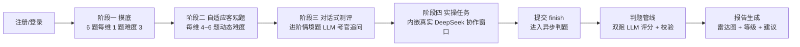

# AI 能力罗盘 · 功能设计文档

> 2026"数字马力杯"第十三届浙江省大学生服务外包创新应用大赛 · A01「AI 能力测评智能体」
> 本文档所有数字与功能均对应仓库真实实现（题库 `seeds/questions/`、引擎 `api/app/engine/`、判题 `api/app/judge/`、报告 `api/app/report/`），可对照代码核验。

## 1. 产品定位

**面向高校学员的 AI 能力自适应测评智能体**：以对话式交互、实操任务考核与自适应客观题三种模式，对学员 6 个核心维度的 AI 能力进行量化评估，输出能力雷达画像、L1~L5 等级认定与个性化学习路径。

- **解决什么问题**：AI 课程教学中"学生会用 AI 吗、用到什么程度、怎么补短板"缺乏可量化的测量工具；传统固定卷测评一刀切，高段学员浪费时间、低段学员受挫。
- **我们的差异化**：自适应引擎按维度动态调节难度（会者难题、不会者基础题，约 30 分钟完成全维度定位）；开放能力由 LLM 依据行为锚定 rubric 自动判分（判分与独立标注一致性 Kappa 0.983，见《评分准确性验证报告》）；报告逐题可解释、可申诉。

## 2. 用户角色

| 角色 | 注册方式 | 核心功能 |
| --- | --- | --- |
| 学员 | 姓名 + 学号 + 班级邀请码自助注册（数据最小化，不收手机号） | 完整测评 / 速测、查看报告与成长趋势、错题本与专项练习 |
| 教师 | 管理员创建账号 | 创建班级、发放邀请码、班级看板（六维均值雷达/维度排名/共性短板 TOP3/学员成长曲线）、CSV 导出 |
| 管理员 | 系统内置账号 | 题库 CRUD（修订自动升版本）、教师账号管理、人工复核队列处理 |

## 3. 测评流程（四阶段 + 异步判题 + 报告）

| 阶段 | 内容 | 判分方式 |
| --- | --- | --- |
| 一 摸底 | 每维度 1 题、难度 ≈3，快速建立初始能力估计 | 规则引擎（客观题） |
| 二 自适应客观题 | 每维度 4~6 题，难度随 θ 动态调整，界面实时显示 θ 轨迹与出题理由 | 规则引擎：单选精确匹配、判断布尔匹配、多选集合匹配 |
| 三 对话式测评 | 从进阶情境题中抽取，LLM 考官多轮追问（SSE 流式输出） | LLM 判题：整卷作答按 rubric 0~4 档评分 |
| 四 实操任务 | 内嵌真实 DeepSeek 对话窗口，学员现场拆解任务、写提示词、甄别整合产出，全程留痕 | 双通道：产物质量（任务 rubric）+ 过程质量（提示词清晰度/拆解性/迭代甄别行为） |
| 提交判题 | `POST /finish` 返回 202，后台线程并行判题，前端轮询 x/y 进度 | 见《技术架构文档》§判题校验链 |
| 报告 | 六维雷达 + 总等级 + 逐题回显 + 个性化建议 | — |

每阶段可暂停续答（测评会话持久化，服务重启自动复位卡死态）；对话题与实操题可主动跳过（score=None、不回灌能力估计、不计入判题，报告如实标注"学员跳过"，不作负向评价）；正式测评答错的客观题进入错题本。

## 4. 三种测评模式与速测

- **自适应客观题**：单选/多选/判断，规则引擎即时判分，零 LLM 成本，覆盖 L1~L3 知识点定位。
- **对话式测评**：考察 L4~L5 高阶应用——学员与 LLM 考官多轮对话作答情境题，考察真实表达与 reasoning 过程而非背诵。
- **实操任务考核**：最接近真实工作场景——在系统内嵌的 AI 协作窗口完成综合任务（如"两周读书节活动方案"），同时考核产出质量与协作过程（AI 贡献留痕）。
- **会话模式**：`full` 完整模式走全四阶段；`quick` 速测模式仅阶段一+二（约 10 分钟），适合课堂快速摸底，牺牲对话/实操维度精度。

## 5. 六维能力模型

模型全文（六维 × L1~L5 行为锚定表）见 `docs/competency-model.md`，等级名称与引擎完全一致：

| # | 维度 | 考察内容 | 等级 |
| --- | --- | --- | --- |
| D1 | AI 基础认知 | 基本概念、模型能力边界、幻觉机理、伦理与安全认知 | L1 初识 / L2 会用 / L3 熟练 / L4 精通 / L5 专家 |
| D2 | 提示词工程 | 指令清晰度、任务拆解、上下文编排、少样本示例设计 | 同上 |
| D3 | AI 工具使用 | 通用大模型、办公 AI 插件、数据分析 AI 的选型与组合 | 同上 |
| D4 | AI 结果评估与优化 | 识别错误、偏见与幻觉；提出改进指令；核查方法论 | 同上 |
| D5 | 人机协同解决问题 | 复杂任务拆解分工、迭代检查点、质量关卡与回退 | 同上 |
| D6 | AI 伦理与合规 | 隐私保护、版权意识、生成内容标注、学术诚信 | 同上 |

每维度独立维持能力估计 θ（1.0~5.0，初始 3.0，Elo 期望式更新），θ 区间映射等级：[1.0,1.8)→L1、[1.8,2.6)→L2、[2.6,3.4)→L3、[3.4,4.2)→L4、[4.2,5.0]→L5；总等级取六维均值过同一映射。

## 6. 题库与每维题例（真实摘自 `seeds/questions/`）

题库共 **300 题**（6 维 × 50 题/维）：客观题 234 道（单选/多选/判断，难度 1~5）+ 开放情境题 48 道 + 实操任务题 18 道；每维基础题（难度 1~3）27 道、进阶题（难度 4~5）23 道。每道进阶题附 0~4 分五档行为锚定 rubric 与评分要点，供 LLM 判题与人工校准共用。以下每维摘录 1 例：

| 维度 | 题号 / 难度 | 题例（节选） |
| --- | --- | --- |
| D1 AI 基础认知 | D1-A01 / 难度 4 | "请解释大语言模型为什么会产生'幻觉'（一本正经地编造事实），说明至少两类常见诱因，并给出至少两种可行的缓解手段及各自的局限。"（评分要点覆盖：概率生成机理、数据侧/交互侧诱因区分、RAG 等缓解手段、各手段局限） |
| D2 提示词工程 | D2-A01 / 难度 4 | "同事让 AI'整理一下会议记录'，得到的输出杂乱不可用。请：1）指出这条提示词缺少的关键要素（至少三个）；2）改写为完整提示词（含角色、任务、背景材料占位、输出格式、约束）；3）说明每个补充要素预期解决什么问题。" |
| D3 AI 工具使用 | D3-A01 / 难度 4 | "三个任务：①综述文献梳理；②社团 logo 初稿；③五班问卷汇总成图表。为每个任务选择合适的 AI 工具或组合，说明选型理由（能力匹配、成本、数据敏感性），以及如何验证产出质量。" |
| D4 结果评估与优化 | D4-A01 / 难度 4 | "请设计一份可复用的'AI 输出核查清单'，至少覆盖六类检查项（事实准确性、时效性、来源可查证、逻辑自洽、偏见倾向、格式合规），每项说明查什么、怎么查、不通过如何处置。" |
| D5 人机协同解决问题 | D5-A01 / 难度 4 | "任务：两周内完成'校园读书节活动方案'。输出完整人机协同计划：子任务拆解；每个子任务由人还是 AI 执行并说明理由；迭代检查点；质量关卡与失败回退预案。" |
| D6 伦理与合规 | D6-A01 / 难度 4 | "请为'在学校工作中使用 AI'设计一份合规检查清单，至少覆盖个人隐私、版权、生成内容标注、学术诚信、数据安全五类风险，每类给出典型场景、检查动作与不可触碰的红线。" |

## 7. 报告与学习建议

- **六维雷达图 + 总等级徽章**：Recharts 渲染，维度得分与 L1~L5 等级一目了然。
- **逐题回显（可解释）**：每题展示题目、学员作答与判分理由（LLM 判题的 rationale 一并入库回显）；判分管线发现自身分歧（三跑极差 >1）或输出降级时，该题自动进入管理端人工复核队列，由管理员终审。
- **个性化学习建议**：基于分级建议库 `seeds/advice_matrix.json`（6 维 × L1~L5 共 30 格，每格含总结/晋升要点/2~4 个真实资源/2~3 个练习任务），由 LLM 结合学员分数个性化组装；LLM 不可用时自动回退模板建议（`advice_source` 字段如实标注来源）。
- **成长趋势**：多次测评后报告页显示历次总评折线（≥2 次自动出现），支持一键导出报告卡为 PNG。
- **错题本与专项练习**：正式测评错题按维度/考点聚合错次，可发起专项练习（抽题避开已答题目）。

## 8. 教师端与管理端

- **教师班级看板**：创建班级/发放邀请码；班级六维均值雷达、维度均分排名、共性短板 TOP3（附薄弱考点标签）、学员表（最新等级/测评次数/成长趋势箭头）、班级成长时间线；一键导出 CSV（UTF-8 BOM，Excel 直开，公式注入已中和）。数据均为班级聚合视图，教师不可见其他班级。
- **管理后台**：题库 CRUD（修订自动升 version、上下线状态管理）、教师账号创建、人工复核队列（查看 LLM 原始判分 JSON → 人工终审改分）。

## 9. 伦理与隐私设计（赛题明文鼓励项）

1. **数据最小化**：仅收集姓名/学号/作答数据，不收手机号；教师端只看聚合统计。
2. **可解释与可复核**：每个分数附评分理由并逐题回显；判分分歧/降级自动进入人工复核队列，管理员终审。
3. **防依赖与过程留痕**：实操任务全程留痕（学员与 AI 的每轮对话入库），过程量表将"人工拆解与甄别行为"纳入评分，引导学员保持独立思考而非一键生成。
4. **偏见控制**：rubric 行为锚定、双跑一致性校验、人工抽检复核三重机制。
