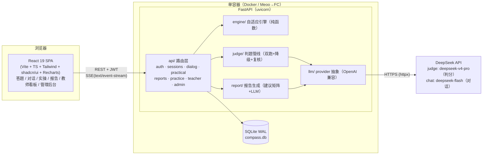
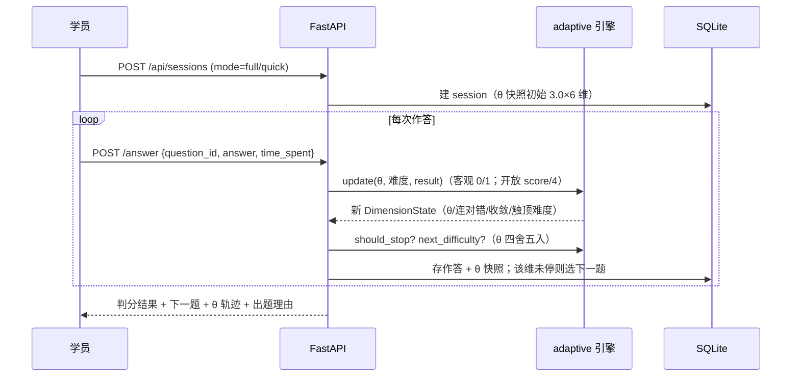
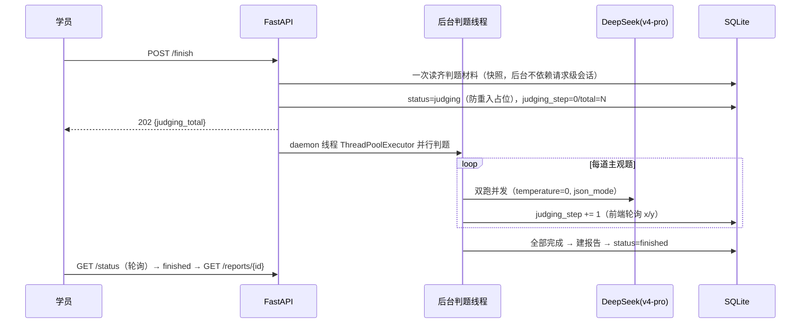
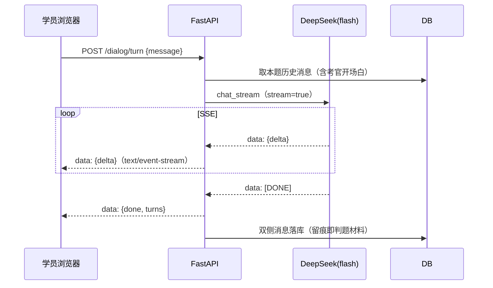

# AI 能力罗盘 · 技术架构文档

> 本文档描述仓库真实实现（`web/` 前端 SPA、`api/app/` 后端单体），所有数字可在代码与测试中核验。

## 1. 总体架构

**单容器单体架构**：FastAPI 同源托管 React SPA 静态产物与 REST/SSE API，SQLite（WAL）持久化，DeepSeek 双模型承担对话与判题。



静态托管：`main.py` 将 `web/dist` 挂载到根路径并对 SPA 深链接做 index.html fallback（含路径穿越防护）；生产部署形态见 `docs/部署指南.md`。

## 2. 技术选型与理由

| 选型 | 版本 | 理由 |
| --- | --- | --- |
| React 19 + TypeScript | 前端 | 组件生态成熟；TS 强类型在测评状态机（阶段流转/判题进度）上显著降低回归成本 |
| Vite | 构建 | 秒级冷启动与产物构建；`tsc -b && vite build` 双重类型门禁 |
| Tailwind CSS 4 + shadcn/ui | UI | 原子化样式 + 可访问组件基座，快速产出高质量界面（评委演示效果权重 20%） |
| Recharts | 图表 | 雷达图/折线图声明式 API，与报告卡导出（html-to-image）组合良好 |
| FastAPI | 后端 | async 原生适配 LLM 高 IO 与 SSE 流式；pydantic 强校验判题 JSON；与 pytest/TestClient 生态无缝 |
| SQLAlchemy 2.0 + SQLite(WAL) | 存储 | 单文件零运维，校赛/网评规模足够；WAL 支持并发读，30s busy timeout 吸收判题写锁；接口层用 ORM，后续可平滑升级 PostgreSQL |
| PyJWT | 认证 | 轻量 JWT（HS256，7 天有效期）+ 角色守卫依赖注入，三角色权限收口在路由层 |
| httpx | LLM 接入 | 同步 Client + 流式迭代；`transport` 参数可注入 MockTransport，测试不发真实请求 |
| DeepSeek（双模型） | 大模型 | OpenAI 兼容、成本低可高频判题、中文能力强；**判分用 deepseek-v4-pro（稳）、对话用 deepseek-flash（快）**；provider 按 `model_role` 切换，可替换为 GLM 等 |
| pytest + vitest | 测试 | 后端 266 项 + 前端 27 项，覆盖引擎纯函数到 API 集成 |

## 3. 代码结构（后端 `api/app/`）

```
app/
├── main.py        # 入口：lifespan（建表/清扫陈旧判题/弱密钥告警）、CORS、SPA 托管
├── config.py      # dataclass 单例配置：环境变量 > api/.env > 默认值
├── auth.py        # JWT 签发/校验、密码哈希、require_roles 角色守卫
├── db.py          # engine/session、WAL pragma、幂等列迁移
├── models.py      # users/classes/questions/sessions/answers/messages/reports/review_queue…
├── engine/        # adaptive.py 自适应引擎（纯函数+不可变状态）、grading.py 客观判分
├── judge/         # pipeline.py 判题管线、stats.py 校准统计纯函数
├── llm/           # provider.py：chat_completion（判题）/ chat_stream（SSE 对话）
├── report/        # generate.py：雷达数据、分级建议（30 格矩阵+LLM 个性化+模板回退）
└── api/           # 8 组路由：auth/sessions/dialog/practical/report/practice/teacher/admin
```

## 4. 核心流程时序

### 4.1 自适应出题与作答（每维度独立）



选题在同维度未答题目中取目标难度（`clamp(round(θ),1,5)`），无精确匹配就近取、同距取低；停止规则满足其一即止：连对 2（须已触达该维题池上限，防强学员被提前掐断）/ 连错 2 / 达 6 题上限 / 近 3 次更新量收敛（<0.15）。答对但用时超预估 2 倍，更新量 ×0.7（记录不扣分）。

### 4.2 异步判题（提交后 202 + 进度轮询）



服务重启时 lifespan 清扫陈旧 `judging` 状态复位为可重试（判题线程不跨进程存活）；线程 spawn 失败回滚占位，学员可重试 finish。跳过/未作答的题目短路零 LLM 调用。实操题为双通道并发（产物 rubric + 过程量表）。

### 4.3 对话式测评 / 实操窗口（SSE 流式）



坏帧跳过不让生成器裸抛；provider 异常时发出 `{error}` + `{done}` 帧而非 500，前端可提示重试。实操窗口同一机制，另提供 submit（产物定格）与 skip。

## 5. 关键工程决策

| 决策 | 做法 | 收益 |
| --- | --- | --- |
| **copy-on-write 测评状态** | `DimensionState` 为 frozen dataclass，`update()` 每次返回新对象 | 纯函数无副作用，θ 演化可单测、可快照序列化进 DB，杜绝共享可变状态竞态 |
| **判题校验链** | schema 强校验（解析失败带错误重试 ≤2）→ 双跑 \|Δ\|≤1 取均值 → 追第三跑取中位 → 仍 >1 入复核 → 全败降级关键词覆盖度 | 温度 0 下双跑 46/50 完全同分；异常输出永不直接进报告，降级如实标注 |
| **MockTransport 保真测试** | provider 保留 `transport` 参数，测试注入 httpx MockTransport 回放真实响应结构（含 SSE 分帧/坏帧） | 测试覆盖真实 HTTP 语义但不发外网请求；conftest 强制空 Key，防测试意外烧钱 |
| **防重入** | finish 先置 `status=judging` 占位，占位期拦截一切流程推进；spawn 失败回滚 | 重复点击/并发 finish 不会重复判题；崩溃遗留卡死态重启自动复位 |
| **判题材料快照** | finish 时一次读齐题目/对话/产物为纯数据任务表 | 后台线程不持有请求级 DB 会话，无跨线程会话竞态 |
| **CSV 公式注入中和** | 导出单元格以 `= + - @ \t \r` 开头时前置单引号 | 教师导出在 Excel 打开无宏风险 |
| **SPA 托管安全** | fallback 先 resolve 并校验 `is_relative_to(dist_root)` | `%2e%2e` 路径穿越被挡（有专项测试） |
| **幂等种子与迁移** | 种子导入按 code upsert + 版本自增；旧库列缺失时 ALTER 补齐 | 升级不丢数据、不重复建题 |

## 6. 测试与质量保障

- **规模与演进**：后端 pytest 从 M1 的 205 项增至当前 **266 项**全绿；前端 vitest **27 项**全绿；`pnpm build`（含 tsc）通过。覆盖：引擎纯函数数学性质、阶段状态机、判题管线（含降级/三跑/复核）、异步判题并发、SSE 坏帧、跳过/续答/恢复、越权（教师跨班 403、角色守卫）、CSV 注入、路径穿越、CORS/JWT 配置。
- **分层策略**：引擎与判题统计为纯函数直接单测；路由层经 TestClient 集成测试；LLM 边界全部 Mock，无一例外不烧真实 Key。
- **评分准确性校准**（对应评分权重 20% 的证明）：50 份四档质量样本（优/中/差/跑题 ×6 维覆盖）经线上同款判分管线与独立标注代理双向盲评：**Pearson 0.9846 / Spearman 0.9840 / 二次加权 Kappa 0.9830**，精确一致率 90%、相邻一致率 100%、0 降级 0 复核。方法学与局限如实见 `docs/评分准确性验证报告.md`（含原始运行输出与 50 行样本数据）。
